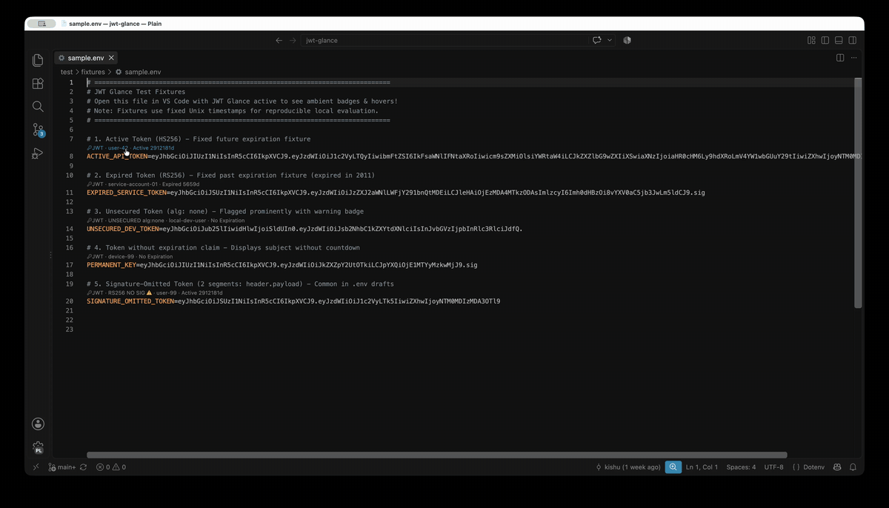
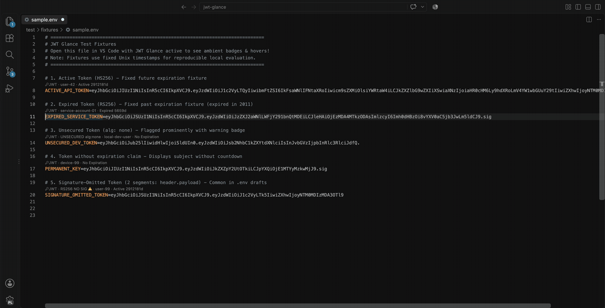
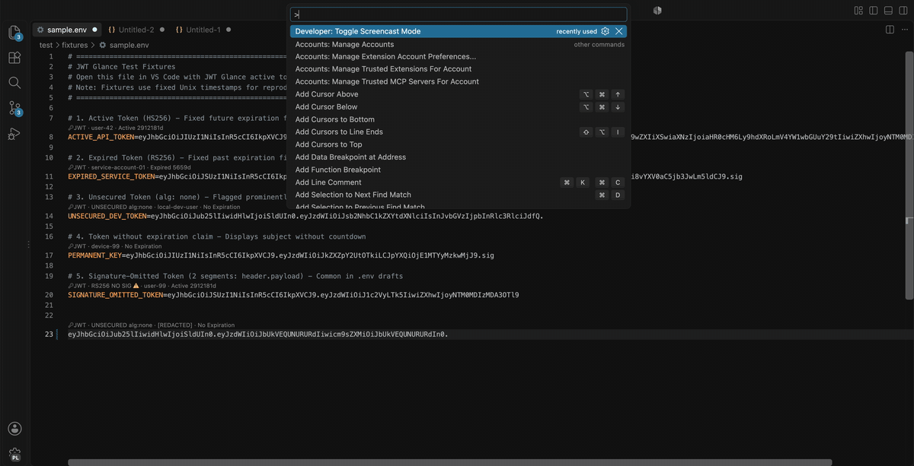

# JWT Glance

> **Zero-click ambient JWT inspection lens for VS Code.**
> *Compatible with VS Code-based editors through VSIX installation.*

JWT Glance automatically surfaces JWT expiration countdowns, algorithm details, and decoded claim cards directly within your editor—eliminating the insecure reflex of pasting sensitive credentials into third-party web decoders (`jwt.io`) and preventing cryptic `401 Unauthorized` test failures caused by stale fixtures.

---

## ✨ Features

- ⚡ **Zero-Click Ambient Badges & CodeLens:** Badges appear immediately above the line (`position: top`) or inline before detected tokens (`position: left`) in `.env`, `.http`, `.rest`, `.json`, `.yml`, and source files (e.g. `[JWT · user-42 · Active 42m]`, `[JWT · RS256 NO SIG ⚠️ · service · Active 2h]`, or `[JWT · UNSECURED alg:none · local-dev-user · Active 42m]`).
- 🧩 **Standard 3-Segment & Two-Segment Inspection:** Accurately inspects standard signed 3-segment tokens (`header.payload.signature`), flags missing signatures on signed algorithms, and supports two-segment JWT inspection (`header.payload`) commonly found in `.env` drafts and mocks.
- 🎯 **Interactive Action Palette:** Click any CodeLens badge (or run `Cmd+Shift+P` → *Inspect Token at Cursor*) to open a quick action menu:
  - **Open Decoded Token in New Editor:** Opens a dedicated, formatted JSON editor tab with syntax highlighting, searchability, and folding.
  - **Copy Redacted Token:** Exports a diagnostic token with custom claim values and signatures redacted for bug reports and tickets.
  - **Copy Actions:** Copy decoded payload JSON or raw token string.
  - **Single-Click Claim Copying:** Copy individual claims directly (`Subject`, `Roles`, `Issuer`, `Audience`, `Expiration`) to clipboard with confirmation.
- ⌨️ **Command Palette & Clipboard Inspection (`Cmd+Shift+P`):** Inspect tokens at cursor, copy redacted tokens, decode tokens straight from the clipboard in memory, or toggle ambient badges with one keystroke.
- 🔍 **Rich Hover Card:** Hover over any token to inspect decoded headers, clean claim tables (`iss`, `sub`, `aud`, `roles`), and formatted payload JSON with explicit signature presence indicator.
- ⏱️ **60-Second Live Timer:** Relative expiration countdowns (`Active 42m` → `Active 41m`) refresh automatically without requiring file edits or typing.
- 🪶 **Zero Runtime Dependencies:** Strictly `"dependencies": {}`. Pure deterministic TypeScript core with fast startup.

---

## 🔒 Security, Privacy & Safe Redaction

- **100% Offline & Private:** JWT Glance runs completely inside your local editor. It makes zero outbound network requests, collects zero telemetry/analytics, and never logs credentials.
- **Decoding ≠ Verification:** Ambient decoding surfaces structural claims for developer convenience. **Decoding a JWT does not prove cryptographic authenticity.** Signatures must always be verified by your backend service against verified public keys or HMAC secrets.
- **System Clipboard & Tab Interactions:**
  - Copy actions (*Copy Decoded Payload*, *Copy Raw Token*, *Copy Claim*, *Copy Redacted Token*) write directly to the OS system clipboard upon explicit user selection.
  - Opening decoded tokens in a new editor tab creates an untitled JSON document, which VS Code may include in its local workspace backup and Hot Exit session restore.
- **Redaction Policy:** The *Copy Redacted Token* command produces a diagnostic token that preserves standard header metadata (`alg`, `typ`, `cty`) and numeric timestamps (`exp`, `nbf`, `iat`), while replacing all custom claims with `"[REDACTED]"` and signatures with `"REDACTED_SIGNATURE"`. The resulting token is structurally valid base64url JSON but intentionally invalid for authentication.

---

## 🚀 Quickstart & Usage

1. **Install JWT Glance** from the VS Code Marketplace or from a packaged `.vsix`.
2. Open any file containing JWTs (e.g. `.env`, `.http`, `.json`, `.yml`, `.ts`, `.py`).
3. **Ambient Badges:** Badges appear above (`position: top`) or inline before (`position: left`) each recognized token showing the subject and relative expiration status.
4. **Hover Cards:** Hover your mouse over any token to view header parameters, claim tables, and formatted payload JSON.
5. **Action Palette:** Click on any CodeLens badge (or run `Cmd+Shift+P` → *Inspect Token at Cursor*) to copy claims, copy redacted diagnostic tokens, or open formatted JSON in a new tab.

---

## ⌨️ Command Palette Actions (`Cmd+Shift+P` / `Ctrl+Shift+P`)

| Command | Description |
| :--- | :--- |
| **`JWT Glance: Inspect Token at Cursor`** | Evaluates token under cursor or active text selection and opens the Action Palette. |
| **`JWT Glance: Inspect Token from Clipboard`** | Reads and decodes a JWT straight from clipboard into memory without writing tokens to disk. |
| **`JWT Glance: Copy Redacted Token`** | Copies a diagnostic copy of the token at cursor/clipboard with custom claims and signature redacted. |
| **`JWT Glance: Toggle Ambient Lens`** | Instantly toggles ambient CodeLens and inline badges on or off. |

---

## ⚙️ Configuration Settings

Customize JWT Glance behavior in your VS Code `settings.json`:

| Setting | Type | Default | Description |
| :--- | :--- | :--- | :--- |
| `jwtGlance.enabled` | `boolean` | `true` | Enable or disable ambient glance badges and hover cards. |
| `jwtGlance.position` | `'top' \| 'left'` | `'top'` | Badge position: `'top'` renders above the line (CodeLens), `'left'` renders inline decoration before token. |
| `jwtGlance.maxLineLength` | `number` | `10000` | Maximum character length of a line to scan (prevents lag on minified files). |
| `jwtGlance.maxDocumentCharacters` | `number` | `524288` | Maximum document character count to scan (~512 KB). Documents exceeding this are skipped to protect editor responsiveness. |
| `jwtGlance.exclude` | `string[]` | `["**/package-lock.json", ...]` | Glob patterns of files to exclude from ambient scanning. |
| `jwtGlance.languages` | `string[]` | `["*"]` | Language identifiers to scan (default `["*"]` for all languages). |

> **Setting scope:** VS Code workspace settings in `.vscode/settings.json` override profile and user settings. If `jwtGlance.position` does not change as expected, check the workspace settings for an existing value. Position changes take effect immediately in open editors.

---

## 🤝 Contributing & Development

For development setup, local debugging (`F5`), test suites, and release packaging instructions, see [CONTRIBUTING.md](CONTRIBUTING.md).

For security policies and vulnerability reporting, see [SECURITY.md](SECURITY.md).

---

## 📄 License

MIT © 2026 kcodek