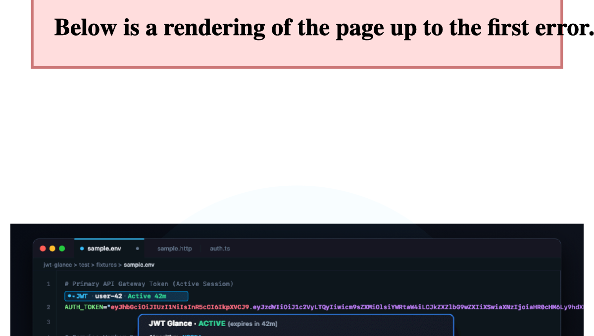

# JWT Glance

> **Zero-click ambient JWT inspection lens for VS Code & Cursor.**




JWT Glance automatically surfaces JWT expiration countdowns, algorithm information, and sanitized claim cards directly within your editor—eliminating the insecure reflex of pasting sensitive credentials into third-party web decoders (`jwt.io`) and preventing cryptic `401 Unauthorized` test failures caused by stale fixtures.


---

## ✨ Features

- ⚡ **Zero-Click Ambient Badges & CodeLens:** Badges appear immediately above the line (`position: top`) or inline before detected tokens (`position: left`) in `.env`, `.http`, `.rest`, `.json`, `.yml`, and source files (e.g. `[JWT · user-42 · Active 42m]`, `[JWT · RS256 NO SIG ⚠️ · service · Active 2h]`, or `[JWT · UNSECURED alg:none · local-dev-user · Active 42m]`).
- 🧩 **Standard 3-Segment & Two-Segment Inspection:** Accurately inspects standard signed 3-segment tokens (`header.payload.signature`), flags missing signatures on signed algorithms, and supports two-segment JWT-like inspection (`header.payload`) commonly found in `.env` drafts and mocks.
- 🎯 **Interactive Action Palette:** Click any badge to open a categorized quick menu:
  - **Open Decoded Token in New Editor:** Opens a dedicated, formatted JSON editor tab with syntax highlighting, searchability, and folding.
  - **Copy Redacted Token:** Exports a structurally valid diagnostic token with sensitive claims redacted for safe inclusion in bug reports and tickets (intentionally invalid for authentication).
  - **Copy Actions:** Copy full decoded payload JSON or raw token string.
  - **Single-Click Claim Copying:** Copy individual claims directly (`Subject`, `Roles`, `Issuer`, `Audience`, `Expiration`) to clipboard with confirmation.
- ⌨️ **Command Palette & Zero-Leak Clipboard Inspection (`Cmd+Shift+P`):** Inspect tokens at cursor, copy redacted tokens, safely decode tokens straight from the clipboard in memory (without writing the token to project files or extension-managed storage), or toggle ambient badges with one keystroke.
- 🔍 **Rich Hover Card:** Hover over any token to inspect decoded headers, clean claim tables (`iss`, `sub`, `aud`, `roles`), and formatted payload JSON with explicit signature presence (`Signature: Present, not verified`, `Signature: Absent`, `Signature: Empty`, or `Signature: Unexpected`).

- 🛡️ **Credential Isolation:** Pure local execution. Raw secret strings are never logged, never transmitted over sockets, and never leaked to external networks.
- ⏱️ **60-Second Live Timer:** Relative expiration countdowns (`Active 42m` → `Active 41m`) refresh automatically without requiring file edits or typing.
- 🪶 **Zero Runtime Dependencies:** Strictly `"dependencies": {}`. Pure deterministic TypeScript core; fast startup with zero supply-chain risk.

---

## 🔒 Security & Privacy Notice

- **100% Offline & Private:** JWT Glance runs completely inside your local editor. It has zero network calls, zero analytics, zero telemetry, and never logs credentials.
- **Decoding ≠ Verification:** Ambient decoding surfaces structural claims for developer convenience. **Decoding a JWT does not prove cryptographic authenticity.** Signatures must always be verified by your backend application against verified public keys or HMAC secrets.

---

## 🚀 How to Run & Use in VS Code

When you run `npm run build:prod` or `npm run build`, esbuild outputs the compiled bundle to:
```text
dist/
├── extension.js        <-- The compiled CommonJS bundle (main entry point)
└── extension.js.map    <-- Source map for debugging
```
Because VS Code requires extensions to be installed or loaded via the extension host, choose one of the three methods below to run it:

---

### Method 1: Package & Install as a `.vsix` (Recommended)

This generates a standalone installable file that works exactly like an extension from the Marketplace.

1. **Package the extension** (from the project root, not inside `dist`):
   ```bash
   $ npm run package
   ```
   This compiles the bundle and creates **`jwt-glance-0.1.0.vsix`** in the repository root directory (`./jwt-glance-0.1.0.vsix`).

2. **Install it into VS Code or Cursor:**
   - **Via Terminal:**
     ```sh
     # In VS Code
     code --install-extension jwt-glance-0.1.0.vsix

     # In Cursor
     cursor --install-extension jwt-glance-0.1.0.vsix
     ```
   - **Via GUI:**
     1. Open VS Code or Cursor.
     2. Press `Cmd+Shift+X` (macOS) or `Ctrl+Shift+X` (Windows/Linux) to open the **Extensions** panel.
     3. Click the `...` menu (Views and More Actions) in the top-right corner of the Extensions sidebar.
     4. Select **Install from VSIX...**.
     5. Choose `jwt-glance-0.1.0.vsix`.

3. **Reload VS Code** if prompted.

---

### Method 2: Direct Symlink (Fastest for Local Development)

You can link this folder directly into your VS Code extensions folder so any future `npm run build` is immediately active without repackaging:

```bash
# For standard VS Code:
ln -s "$(pwd)" ~/.vscode/extensions/jwt-glance

# For Cursor:
ln -s "$(pwd)" ~/.cursor/extensions/jwt-glance

# For VS Code Insiders:
ln -s "$(pwd)" ~/.vscode-insiders/extensions/jwt-glance
```

After creating the link:
1. Run `npm run build` (or `npm run build:prod`).
2. In VS Code, press `Cmd+Shift+P` and select **`Developer: Reload Window`**.
3. JWT Glance is now active!

---

### Method 3: Extension Development Host (`F5` Debugging)

To test changes in a clean, isolated development window without installing anything:

1. Open this repository root folder in VS Code:
   ```bash
   code .
   ```
2. Press **`F5`** (or go to **Run and Debug** `Cmd+Shift+D` and click the green play button).
3. A separate **[Extension Development Host]** window will open with JWT Glance running live.
4. Press `Cmd+R` inside the guest window anytime you rebuild to reload changes.

---

### ✅ Verifying It Works in VS Code

1. **Verify Ambient Badges:** Open [`sample.env`](https://github.com/kcodek/jwt-glance/blob/main/test/fixtures/sample.env) or [`sample.http`](https://github.com/kcodek/jwt-glance/blob/main/test/fixtures/sample.http). You will see the live badges above or before the tokens (e.g. `[JWT · user-42 · Active 42m]`).
2. **Verify Hover:** Hover your mouse over any token to see the decoded claims table, signature presence status, and payload.
3. **Verify Action Palette:** Click any badge to open the quick copy, copy redacted token, and tab preview menu.
4. **Verify Command Palette:** Press `Cmd+Shift+P`, type `JWT Glance`, and run `JWT Glance: Inspect Token at Cursor`, `JWT Glance: Inspect Token from Clipboard`, or `JWT Glance: Copy Redacted Token`.

---

## ⌨️ Command Palette Actions (`Cmd+Shift+P` / `Ctrl+Shift+P`)

Access quick commands anytime without needing to click with the mouse:

| Command | Description |
| :--- | :--- |
| **`JWT Glance: Inspect Token at Cursor`** | Evaluates token under the cursor or active text selection and opens the Action Palette. If no token is at cursor, prompts to inspect clipboard. |
| **`JWT Glance: Inspect Token from Clipboard`** | **Zero-leak mode:** Reads and decodes a JWT straight from the system clipboard into memory, opening claims and decoded JSON without writing tokens to project files or extension storage. |
| **`JWT Glance: Copy Redacted Token`** | Creates a structurally valid copy of the token at cursor or in clipboard with unverified claims redacted. (Intentionally invalid for authentication). |
| **`JWT Glance: Toggle Ambient Lens`** | Instantly toggles ambient CodeLens and inline badges on or off. |

---

## 🛠️ How to Test WITHOUT Installing as an Extension

You don't need to install the `.vsix` to test or develop JWT Glance. Three zero-install testing workflows are available:

### Approach 1: Extension Development Host (F5 Debugging)
Run the extension in a temporary, isolated VS Code window directly from source code:

1. Open this repository in VS Code:
   ```bash
   code .
   ```
2. Press **`F5`** (or open the **Run & Debug** tab `Cmd+Shift+D` and click **"Run Extension (Development Host)"**).
3. An **[Extension Development Host]** VS Code window will launch with JWT Glance active.
4. In that development window, open [`sample.env`](https://github.com/kcodek/jwt-glance/blob/main/test/fixtures/sample.env) to see live badges and hover cards.
5. Any source changes you make in `src/` can be reloaded instantly in the guest window via `Cmd+R` (or `Developer: Reload Window`).

---

### Approach 2: Terminal CLI Inspector (No Editor Needed)
Inspect and preview any JWT token from the command line without opening VS Code:

```bash
# Test any custom token:
npm run inspect -- "<YOUR_JWT_TOKEN_HERE>"

# Or run with the built-in fixture sample:
npm run inspect
```

**Terminal Output Preview:**
```text
--- Ambient Badge Preview ---
[JWT · user-42 · Active 42m]

--- Decoded Assessment Object ---
{
  recognized: true,
  algorithm: 'HS256',
  isUnsecured: false,
  segmentCount: 3,
  signature: { presence: 'PRESENT', verification: 'NOT_PERFORMED' },
  temporalStatus: 'ACTIVE',
  expiresAtIso: '2026-09-10T14:00:00.000Z',
  secondsUntilExpiration: 2520,
  issuedAtIso: '2026-09-10T12:00:00.000Z',
  notBeforeIso: null,
  issuer: 'https://auth.example.com',
  audience: null,
  subject: 'user-42',
  roles: [ 'admin', 'developer' ],
  warnings: []
}

--- Hover Card Markdown Preview ---
### JWT Glance · `ACTIVE` (expires in 42m)
**Algorithm:** `HS256` &nbsp;|&nbsp; > ℹ️ **Signature: Present, not verified** *(Local inspection only)*

**Expires:** `2026-09-10T14:00:00.000Z` &nbsp;•&nbsp; **Subject:** `user-42` &nbsp;•&nbsp; **Issuer:** https://auth.example.com &nbsp;•&nbsp; **Roles:** `admin, developer`
```

---

### Approach 3: Automated Test Suite
Run the full test suite via Node's native test runner (`node:test`):

```bash
# Run all tests (unit, syntax scanner, security vectors, performance, and corpus)
npm test
```

**Run targeted test suites:**
```bash
# Compile tests
npm run test:compile

# Test badge formatting
node --test out/test/unit/badgeFormatter.test.js

# Test document filtering
node --test out/test/unit/filter.test.js

# Test token detection across .env, .http, JSON, SQL, bash
node --test out/test/unit/lineScanner.test.js

# Test security attack vectors (alg confusion, malformed payloads)
node --test out/test/unit/attackVectors.test.js

# Test performance (10,000 lines scanned in under 50ms)
node --test out/test/perf/scannerBenchmark.test.js

# Test 12,000-sample adversarial corpus (verifies zero false positives)
node --test out/test/corpus/adversarial.test.js
```

---

## ⚙️ Configuration Settings

Customize JWT Glance behavior in your VS Code `settings.json`:

| Setting | Type | Default | Description |
| :--- | :--- | :--- | :--- |
| `jwtGlance.enabled` | `boolean` | `true` | Enable or disable ambient glance badges and hover cards. |
| `jwtGlance.position` | `'top' \| 'left'` | `'top'` | Badge position: `'top'` renders above the line (CodeLens), `'left'` renders inline decoration before the token. |
| `jwtGlance.maxLineLength` | `number` | `10000` | Maximum character length of a line to scan (prevents lag on minified files). |
| `jwtGlance.maxDocumentCharacters` | `number` | `524288` | Maximum document character count to scan (default 524,288 characters, ~512 KB). Documents exceeding this are skipped to protect editor responsiveness. |
| `jwtGlance.exclude` | `string[]` | `["**/package-lock.json", ...]` | Glob patterns of files to exclude from ambient scanning. |
| `jwtGlance.languages` | `string[]` | `["*"]` | Language identifiers to scan (default `["*"]` for all languages). |

---

## 🚢 Publishing & Tag-Based Release Workflow

Publishing is automated via the repository's tag-based GitHub Actions workflow ([`.github/workflows/release.yml`](https://github.com/kcodek/jwt-glance/blob/main/.github/workflows/release.yml)).

### 1. Prerequisites
- **Visual Studio Marketplace**: Register a publisher on [Marketplace Management Portal](https://marketplace.visualstudio.com/manage) and generate a Personal Access Token (`VSCE_PAT`) in Azure DevOps.
- Configure repository secret `VSCE_PAT` in GitHub Repository Settings.

### 2. Pre-Flight Verification Gate
Execute the local verification pipeline before cutting a release:

```bash
# 1. Run full test suite & adversarial corpus
npm test

# 2. Compile minified production bundle
npm run build:prod

# 3. Audit files included in package
npx @vscode/vsce ls

# 4. Generate the .vsix package
npm run package
```

> [!TIP]
> The package excludes source, tests, development configuration and preview media.

### 3. Release Process
1. Bump version in `package.json` (e.g. `"version": "0.1.0"`).
2. Commit and push a matching Git tag:
   ```bash
   git tag v0.1.0
   git push origin v0.1.0
   ```
3. The release workflow automatically validates that the tag matches `package.json`, runs tests, packages the VSIX, publishes to Visual Studio Marketplace, and creates a GitHub Release with the VSIX attached.


---

## 🏗️ Architecture Invariants

- **Hexagonal Separation:** Pure TypeScript evaluation logic in `src/core/` contains **zero** dependencies and **zero** imports from `vscode` or Node filesystem modules.
- **Strict Trust Semantics:** Unverified tokens are labeled `Signature: Present, not verified` (or `Absent` / `Empty` / `Unexpected`) to prevent false senses of cryptographic security.
- **High-Signal Ambient Badges:** Badges prioritize credential identity (`sub`) and temporal freshness (`Active` / `Expired`), keeping full claim payloads safely accessible via the hover card and interactive action palette.

---

## 📄 License

MIT © 2026 JWT Glance Contributors
